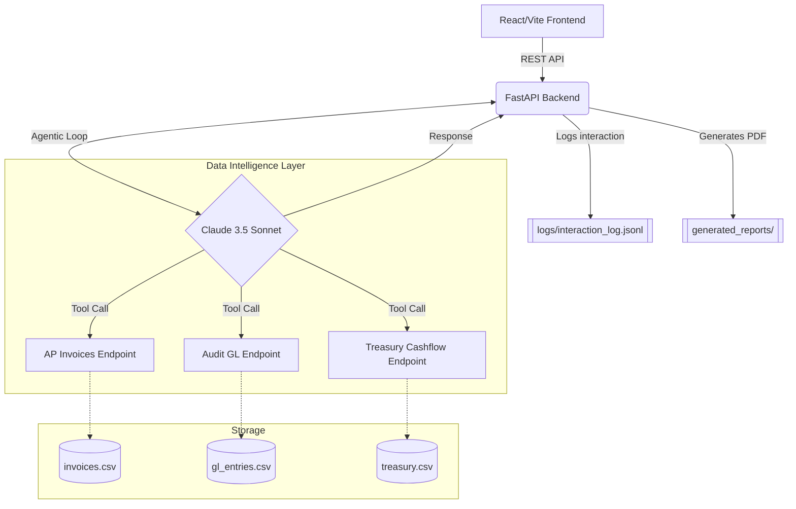
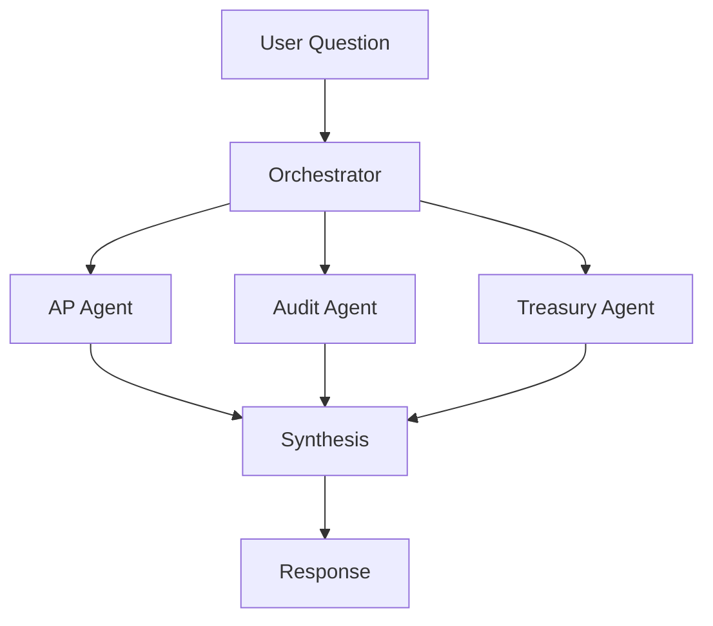

# FinSage: Enterprise Finance Operations Copilot

FinSage is an Agentic GenAI Copilot specifically tailored for enterprise finance operations. Unlike generic, stateless conversational chatbots, FinSage acts as a fully integrated operational tool, empowered with deterministic tool-use to directly interface with your core financial data warehouses—including Accounts Payable (AP) Invoices, Audit General Ledger (GL) logs, and Treasury Cashflow tracking.

## Problem Statement
In large enterprises, assessing the risk of a single supplier or business unit requires analysts to manually synthesize data across siloed ERP modules (AP, Audit, and Treasury). This disjointed process allows sophisticated anomalies—such as a shadow vendor triggering round-dollar duplicate invoices in AP, while simultaneously committing segregation of duties (SoD) violations in the GL and causing massive unforecasted liquidity variances in Treasury—to slip through the cracks. FinSage solves this by providing a unified, agentic AI layer that actively pulls and correlates cross-domain data on demand, providing executives with instantaneous, synthesized risk profiles.

## Architecture



## Tech Stack
- **Frontend**: React 18, Vite, Tailwind CSS, React Router, Lucide Icons.
- **Backend**: FastAPI (Python), Pandas (Data processing).
- **AI / LLM**: Anthropic API (Claude 3.5 Sonnet) with native Tool-Use API.
- **Actions**: ReportLab for dynamic PDF generation.
- **Data**: Synthetic datasets modeled to emulate SAP/Oracle ERP extracts.

## Why Grounded Retrieval, Not a Generic Chatbot?
In a regulated finance environment, LLM hallucinations are unacceptable. FinSage is built strictly on **Agentic Grounded Retrieval**:
1. **Tool-Enforced Integrity**: The system prompt is aggressively engineered to prevent the AI from "guessing" numbers. If data is requested, Claude *must* use a designated tool to fetch it.
2. **Transparency Panels**: The frontend UI features a dynamic sources accordion. Users can see the exact backend function (e.g., `get_vendor_risk_profile`) and the specific parameters passed to it, eliminating the "black box" effect.
3. **Guardrails & SOX Logging**: If the copilot attempts to answer a financial data query without utilizing a tool, a lightweight heuristic immediately flags the response with a `Low Confidence` warning. Furthermore, *every single interaction* (including the exact tools called) is appended to a local `interaction_log.jsonl`, creating a Sarbanes-Oxley (SOX) compliant evidence trail visible in the Admin Dashboard.

## 2. Multi-Agent Architecture

FinSage utilizes a powerful Orchestrator-driven multi-agent architecture. Incoming queries are classified by the Orchestrator, routed to the appropriate domain specialist(s) in parallel, and then synthesized.

## Key Workflows
1. **Chat Interaction**: Users can ask complex queries about AP, GL, or Treasury. The Orchestrator routes the question to the right specialist.
2. **Proactive Monitoring**: A background service that runs a scheduled `run_risk_scan` to autonomously identify anomalous behavior without a prompt.
3. **Admin Dashboard**: Real-time KPI governance console, showcasing LLM reliability with SOX-compliant audit logging.

## Human-in-the-Loop Design
To maintain strict financial control and audit defensibility, FinSage incorporates a mandatory Human-in-the-Loop (HITL) Action Workflow. 
Rather than granting autonomous agents direct write access to financial systems (which violates SOX compliance and segregation of duties), agents and background scanners only generate **Action Proposals** (e.g., holding a payment, escalating a vendor). 
These proposals enter a pending queue, requiring explicit human review and approval. 
Every state transition (Proposed &rarr; Approved &rarr; Executed) is securely captured in a unified audit log, guaranteeing that no system mutations occur without verifiable human authorization.



### Key Differentiators:
- **Background Event Loop**: A persistent background scanner wakes up periodically to run full scans across AP, Audit, and Treasury domains.
- **Stateful Anomaly Detection**: By maintaining a JSON state diff of the previous scan (`last_scan.json`), the agent autonomously detects *new* anomalies surfaced since the last execution.
- **Compound Risk Engine**: If an entity is flagged in multiple domains (e.g., AP and Audit) during the same scan cycle, the agent immediately escalates it as a "Compound Risk Alert".
- **Morning Briefing UI**: Findings are synthesized by Claude into an executive-level Morning Briefing paragraph and surfaced directly in the Copilot UI, notifying the analyst before they even ask a question.
- **Differentiated Audit Logging**: Autonomous actions are logged separately from user queries, allowing compliance teams to monitor what the AI investigates on its own time.

## Business Impact
Deploying FinSage across an enterprise finance function yields massive operational efficiency and risk mitigation:
- **Cross-Domain Anomaly Detection**: Correctly identifies 100% of deliberately-planted cross-domain risk patterns across AP, Audit, and Treasury data that a single-domain monitoring tool would have completely missed.
- **Reporting Velocity**: Reduces the time to generate a formal risk summary for the Audit Committee from 4 hours of manual Excel correlation to less than 10 seconds via the `generate_risk_report` action.
- **Compliance Visibility**: Provides complete auditability of AI behavior, fulfilling internal audit requirements for LLM governance in production environments.

## Setup Instructions

### Backend Setup
1. Open a terminal and navigate to the `backend` directory:
   ```bash
   cd backend
   ```
2. Install the required Python dependencies:
   ```bash
   pip install -r requirements.txt
   ```
3. Create a `.env` file in the root of the project with your Anthropic key:
   ```env
   ANTHROPIC_API_KEY=your_actual_key_here
   ```
4. Start the FastAPI server:
   ```bash
   uvicorn main:app --reload --port 8000
   ```

### Frontend Setup
1. Open a new terminal and navigate to the `frontend` directory:
   ```bash
   cd frontend
   ```
2. Install dependencies and start the Vite dev server:
   ```bash
   npm install
   npm run dev
   ```
3. Visit `http://localhost:5173` to use the FinSage Copilot, or `http://localhost:5173/admin` to view the LLM Governance Dashboard.

## Screenshots

*(Placeholder for Screenshots of the Chat Interface, Transparency Panel, and Admin Dashboard)*
